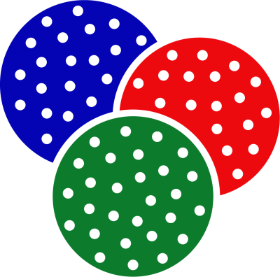

# Veri

Veri is a Distributed Feature Store optimized for Search and Recommendation tasks.

Feature Label store allows storing features as keys and labels as values.
Querying values is only possible with knn using features.

Veri also supports creating sub sample spaces of data by default.

# Probabilistically Scaling Vector Spaces

Veri works as a cluster that can hold a Vector Space with fixed dimension and allows easy querying of k nearest neighbour search queries and also querying a sample space to be used in a machine learning algorithm.

Veri is currently in Beta Stage

*Veri means data in Turkish.*

Veri is not a regular database, instead it is purely designed to be used in machine learning. It does not give any guarantee of responding with the same result every time.

In machine learning, data scientist usually convert data into a feature label vector space, when a space is ready it is almost always about writing and optimising the algorithm.

I have worked in different roles as a Data Engineer, Data scientist and a Software Developer. In many projects, I wanted a scalable approach to vector space search which is not available. I wanted to optimise the data ingestion and data querying into one tool.

Veri is meant to scale. Each Veri instance tries to synchronise its data with other peers and keep a statistically identical subset of the general vector space.

## What does statistically identical mean?

Veri keeps the average (Center) and a histogram of distribution of data with the distance to the center (Euclidean Distance).
Every instance continue, exchanging data as long as their average and histogram are not close enough.

## Knn querying

Veri internally has an internal key-value store, but it also queries its neighbours and merges the result. 
It is very similar to map-reduce process done on the fly without planning.

When a knn query is stated, veri creates a unique hash,
Starts a timer,
Then do a local knn search locally,
Then calls its peers to do the same with a smaller timeout,
Merges results into a map,
Waits for timeout and then do a refine process on the result map,
and return.

if a search with the same id received, query is rejected to avoid infinite recursions. This behaviour will be replaced with cached results and checking timeout.

Every knn query has a timeout and timeout defines the precision of the result. User can trade the precision for time. In production users usually want a predictable response time. Since every Veri instance keeps a statistically identical in most classification case you will get the same result.

## High Availability

Veri replicates the data to its peers periodically and data is persisted to the disk for crahes.

TODO:
- Test multinode syncranization
- Authentication.
- Documentation.

### Note:
Veri uses [badger](https://github.com/dgraph-io/badger) internally. Many functions are made possible thanks to badger.

Contact me for any questions: berkgokden@gmail.com
